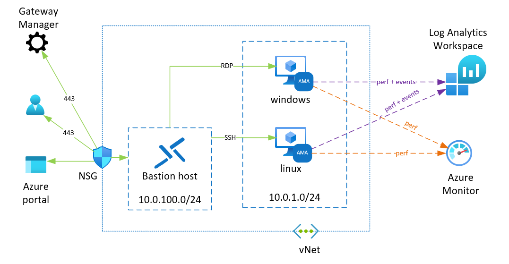

# Evaluation of Azure Monitor Agent

## Description
This repository contains code to create a simple environment consisting of two virtual machine, one of each kind, to evaluate Azure Monitor Agent (AMA). The agent is installed by ARM templates whereas the virtual machines are created by terraform.  
Performance metrics and events are sent to both Log Analytics Workspace and Azure Monitor Metrics while events are sent only to Log Analytics. The Log Analytics Workspace is not created by code stored in this repository, however, it needs to be created separately.  



## Steps to reproduce

### Deploy virtual machines and bastion host with terraform
- Create a copy of terraform.tfvars.gittemplate and name it terraform.tfvars
```
cp terraform.tfvars.gittemplate terraform.tfvars 
```
- **Make sure terraform.tfvars won't leak to git repository before filling in sensitive data**. Double check that terraform.tfvars is included in the gitignore file.
- Update sensitive variables in terraform.tfvars and other variables in variables.tf such as:
  * The source address in NSG rules nsg_rules from which the access to VM(s) is allowed.
  * The local name to create a unique distinguisher for resource group and other resource.
  * Update teh path to the public key used to authenticate on linux VM

- Login to az cli and set your default subscription to use for deployments 
```
az login
az account set --subscription "My Demos"
```

- Deploy the resources through terraform.
```
terraform init
terraform apply
```

Virtual machines are supposed to be accessible through bastion host

Access is allowed only from a specific source IP address mentioned in the NSG

### Create Data Collection Rules (DCR) by ARM
Continue with creating the data collection rules by using the ARM templates in the directory [DataCollectionRules_ARM](DataCollectionRules_ARM)
Remember to customize the name of the log analytics workspace. As the workspace external ID use information from JSON in the top right corner when reviewing the desired Log Analytics Workspace in azure portal. 

Its format is expected to be like this:
"/subscriptions/xxxxxxxxxxxx/resourceGroups/xxxxxxxxxxxxxxx/providers/Microsoft.OperationalInsights/workspaces/xxxxxxxxxx",


### Add resources to DCR
Finally, get the virtual machines associated with the DCR rules either by manually or by applying the built-in policies 

- Configure Azure Monitor Agent to Linux virtual machines and associate to Data Collection Rule
- Configure Azure Monitor Agent to Windows virtual machines and associate to Data Collection Rule


